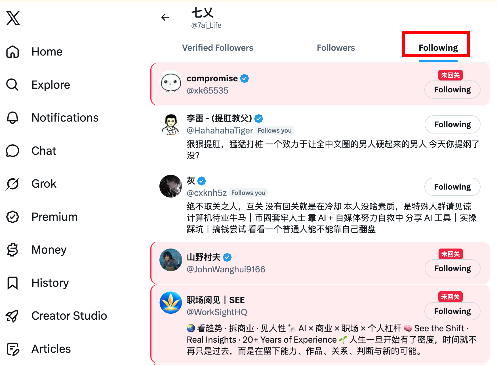
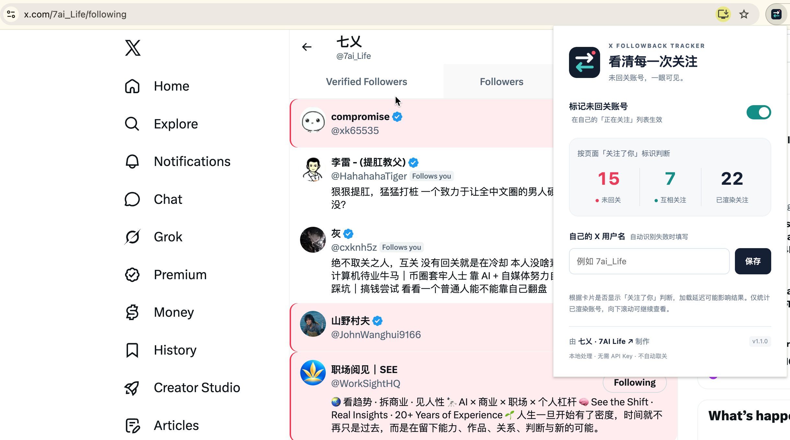

# 安装 X Followback Tracker

**推荐从 Chrome 应用商店安装：打开商店 → 添加至 Chrome → 刷新 X。** 无需编程或 API Key。

## 推荐方式：Chrome 应用商店

1. 在电脑端 Chrome 中打开 **[X Followback Tracker 商店页面](https://chromewebstore.google.com/detail/x-followback-tracker/jappopnfojjgcmbmpehakeepojbcfmkf)**。
2. 点击 **「添加至 Chrome」**，在浏览器弹窗中确认 **「添加扩展程序」**。
3. 安装完成后刷新 X，进入自己的 **「正在关注 / Following」** 列表，即可查看标记。

商店安装无需下载 ZIP、解压或开启开发者模式。点击工具栏的拼图图标，可将插件固定到工具栏。

### 已经安装过 GitHub 本地版？

先打开 `chrome://extensions`，停用原先通过「加载已解压的扩展程序」安装的版本，再安装商店版。确认商店版正常后，可移除旧版。请勿同时开启两份扩展；原本地版设置不会自动迁移，安装后可重新填写用户名及调整开关。

## 备用方式：GitHub ZIP 手动安装

无法使用商店或需要手动安装时，使用以下步骤。适用于电脑端 Chrome / Edge。

### 1. 下载安装包并解压

**[点击下载安装包 v1.1.3](https://github.com/7ai-Life/X-Followback-Tracker/releases/download/v1.1.3/X-Followback-Tracker-Install-v1.1.3.zip)**

下载的文件名是：`X-Followback-Tracker-Install-v1.1.3.zip`。

Windows 右键 →「全部解压缩」；macOS 双击解压。解压后只有一个文件夹：

```text
X-Followback-Tracker 安装包
```

把这个文件夹放到「文稿 / Documents」等长期保留的位置。安装后不要删除或移动它。

### 2. 在浏览器中加载这个文件夹

1. 将对应地址粘贴到地址栏并回车：Chrome 使用 `chrome://extensions`；Edge 使用 `edge://extensions`。
2. 打开「开发者模式 / Developer mode」。
3. 点击「加载已解压的扩展程序 / Load unpacked」。
4. 选择刚才解压得到的 **`X-Followback-Tracker 安装包` 文件夹**，点击「选择文件夹」或「打开」。

**直接选择这个文件夹即可，不用进入里面再找其他目录。** 成功后会出现 **X Followback Tracker** 扩展卡片，版本为 **1.1.3**，开关处于开启状态。

浏览器安装方式参考 [Chrome 官方说明](https://developer.chrome.com/docs/extensions/get-started/tutorial/hello-world#load-unpacked) / [Edge 官方说明](https://learn.microsoft.com/en-us/microsoft-edge/extensions/getting-started/extension-sideloading)。

## 安装后：刷新 X，打开自己的「正在关注」

登录 X，刷新页面，然后从自己的个人主页进入 **「正在关注 / Following」**，等待页面加载约 1 秒。

未显示「关注了你 / Follows you」标识的已关注账号，会出现浅红背景和「未回关」标签。向下滚动会继续识别。

[](screenshots/x-following-markers.png)

[点击查看原图（1752 × 1288）](screenshots/x-following-markers.png)

## 开关和统计在哪里？

点击浏览器工具栏中的扩展菜单（通常是拼图图标），找到 **X Followback Tracker**。可将它固定到工具栏，方便随时打开。

弹窗中可以开关标记、查看当前已渲染账号的统计。自动识别账号失败时，填写自己的用户名（如 `7ai_Life`）并保存，不要填写显示昵称或完整网址。

[](screenshots/x-followback-popup.png)

[点击查看原图（2438 × 1360）](screenshots/x-followback-popup.png)

截图展示 v1.1.0 的实际运行状态，用于说明关注列表标记和弹窗操作；实际版本以商店页面或扩展管理页为准。

## 常见问题

### 下载页面有多个 ZIP，该选哪个？

推荐先从 Chrome 应用商店安装，无需选择 ZIP。使用备用手动安装时，只下载名称包含 **`Install`（安装包）** 的 ZIP。`Source` 和 GitHub 自动生成的 `Source code` 都是给开发者的源码，不需要下载。

### 提示找不到 manifest.json？

确认已解压 ZIP，并选择「X-Followback-Tracker 安装包」文件夹。这个文件夹内应该直接能看到 `manifest.json`。个别解压工具可能额外创建一层外部目录，此时选择里面同名且包含该文件的文件夹。

### 安装成功，但没有标记？

先刷新 X，确认正在查看**自己**的「正在关注 / Following」，并检查插件开关已开启。打开弹窗查看状态，身份识别失败时填写用户名。当前列表也可能全部已互关，可向下滚动查看。

仍无效时，在浏览器扩展详情中检查是否允许在 `https://x.com` 运行，或到 [Issues](https://github.com/7ai-Life/X-Followback-Tracker/issues) 反馈浏览器版本、插件版本、页面语言与复现步骤。

### 怎么更新？

**商店版：** 由 Chrome 自动接收商店已发布的更新，无需重复下载安装包。更新后刷新 X。

**GitHub 手动安装版：** 下载新版安装包并解压。将新版文件夹中的内容更新到原来加载的「X-Followback-Tracker 安装包」目录，再到浏览器扩展管理页点击刷新按钮，最后刷新 X。

如果之前加载的是旧版 `extension` 目录，也可直接关闭旧扩展，再按本教程加载新文件夹。避免同时开启两份扩展。

### 为什么统计数量不是我全部关注的人数？

只统计当前页面已渲染的账号，滚动时可能变化。插件不会自动滚到底，也不会读取完整关注关系。

### 标记是否绝对准确？

依据卡片是否显示「关注了你 / Follows you」推断。页面加载延迟或 X 改版可能影响结果，重要账号可进入主页再次核实。

### 会自动取关、上传数据吗？

不会自动关注、取关、发帖或私信。数据在本地处理，仅保存开关和可选用户名。见 [隐私说明](PRIVACY.md)。

### 公司浏览器不允许加载？

可能是管理员策略限制，请联系管理员或使用允许本地安装扩展的个人浏览器。本教程面向电脑端 Chrome / Edge，不适用于手机、Safari 或 Firefox。

### 怎么卸载？

在浏览器扩展管理页找到 X Followback Tracker，点击「移除」，然后刷新 X。如果此前使用 ZIP 手动安装，卸载后可以删除对应本地文件夹。

---

[项目主页](https://github.com/7ai-Life/X-Followback-Tracker) · [作者：七乂 · 7AI Life](https://x.com/7ai_Life)
