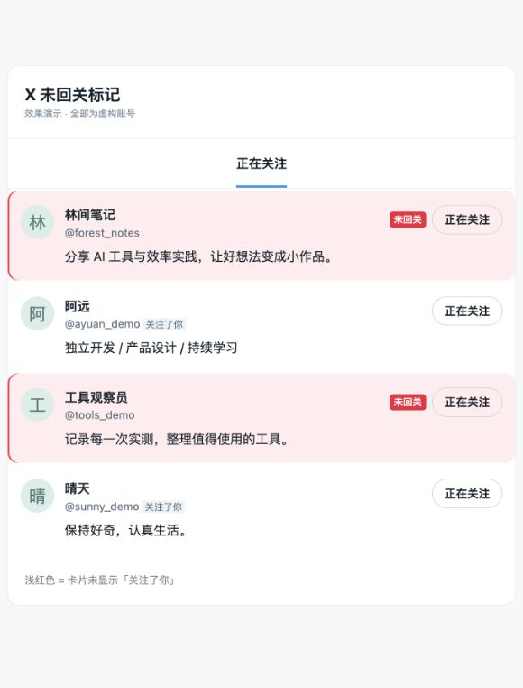
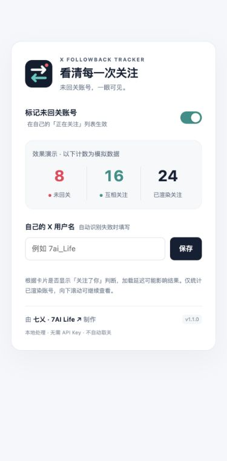

# X Followback Tracker 安装教程

用几分钟，为自己的 X 关注列表加上「未回关」标记。

适用环境：电脑上的 Chrome 或 Microsoft Edge。无需 API Key，无需安装 Node.js。本教程不适用于手机浏览器、Safari 或 Firefox。

## 第 1 步：下载安装包

打开 [GitHub 最新版本页面](https://github.com/7ai-Life/X-Followback-Tracker/releases/latest)，在页面下方的 **Assets** 中下载：

```text
X-Followback-Tracker-v1.1.0.zip
```

也可以 [直接下载 v1.1.0](https://github.com/7ai-Life/X-Followback-Tracker/releases/download/v1.1.0/X-Followback-Tracker-v1.1.0.zip)。

请选择名称以 `X-Followback-Tracker-v` 开头的安装包。GitHub 自动生成的 `Source code (zip)` 是完整源码，普通用户优先下载安装包。

## 第 2 步：解压到固定位置

- **Windows**：右键 ZIP →「全部解压缩」。
- **macOS**：双击 ZIP 解压。

将解压后的文件夹放在「文稿 / Documents」等长期保留的位置。安装后不要删除或移动它，浏览器会持续读取其中的文件。

解压后，应找到这样的目录：

```text
X-Followback-Tracker/
├── README.md
├── docs/
└── extension/                 ← 安装时选择这一层
    ├── manifest.json
    ├── content.js
    ├── content.css
    ├── popup.html
    ├── popup.js
    ├── popup.css
    └── icons/
```

不同解压工具可能额外包一层目录。判断标准始终是：**所选文件夹里能直接看到 `manifest.json`。**

## 第 3 步：打开浏览器扩展管理页

将对应地址复制到浏览器地址栏，按回车：

| 浏览器 | 地址 |
| --- | --- |
| Google Chrome | `chrome://extensions` |
| Microsoft Edge | `edge://extensions` |

这是浏览器内部页面地址，需要在地址栏打开，不能当作搜索词搜索。

## 第 4 步：加载扩展

1. 开启页面中的「开发者模式 / Developer mode」。
2. 点击「加载已解压的扩展程序 / Load unpacked」。Edge 中文按钮也可能显示「加载解压缩的扩展」。
3. 在文件选择窗口中，选中刚才解压得到的 **`extension` 文件夹**。
4. 点击「选择文件夹」或「打开」。

成功后，扩展管理页会出现 **X Followback Tracker** 卡片，版本为 **1.1.0**，开关处于开启状态。

本地加载方式参考 [Chrome 官方文档](https://developer.chrome.com/docs/extensions/get-started/tutorial/hello-world#load-unpacked) 和 [Edge 官方文档](https://learn.microsoft.com/en-us/microsoft-edge/extensions/getting-started/extension-sideloading)。

## 第 5 步：在 X 上使用

1. 打开 [X](https://x.com)，登录你自己的账号。
2. 如果安装前已经打开 X，请先**刷新网页**。
3. 进入自己的个人主页，点击「正在关注 / Following」。网址通常为 `https://x.com/你的用户名/following`。
4. 等页面加载约 1 秒：未显示「关注了你 / Follows you」的已关注账号，会出现浅红背景和「未回关」标签。
5. 继续向下滚动，插件会处理新加载的账号。



**应打开自己的 Following，不是 Followers（关注者），也不是别人的关注列表。**

## 第 6 步：固定图标与查看统计

点击浏览器工具栏的扩展菜单（通常是拼图图标），找到 **X Followback Tracker**，使用「固定」或「在工具栏中显示」。不同浏览器的图标可能略有不同。

打开扩展弹窗后可以：

- 开关「标记未回关账号」。
- 查看当前页面已渲染账号的未回关、互关和总数。
- 在自动识别失败时填写自己的用户名，例如 `7ai_Life`，点击「保存」。不要填写显示昵称或整段主页 URL。
- 点击底部「七乂 · 7AI Life」访问作者主页。



X 会按需加载和回收列表元素，因此计数随滚动变化，不代表账号全部关注关系。

## 如何更新

本地加载版需要手动更新：

1. 到 [Releases](https://github.com/7ai-Life/X-Followback-Tracker/releases) 下载新安装包并解压。
2. 将新版 `extension` 文件夹内的文件更新到原来加载的 `extension` 目录，确认 `manifest.json` 的版本已更新。
3. 回到扩展管理页，点击 X Followback Tracker 卡片上的刷新按钮。
4. 刷新 X 页面。

如果希望保留不同版本，也可以关闭旧扩展，再从新版 `extension` 文件夹重新加载。避免同时开启两份扩展；重新加载到不同路径可能需要重新设置开关或用户名。

## 常见问题

### 提示「无法加载扩展」或找不到 manifest.json

确认已经解压 ZIP，并选择直接含有 `manifest.json` 的 `extension` 文件夹。不要选择 ZIP 文件，也不要选择它上面的项目根目录。

### 安装成功，但 X 没有标记

按顺序检查：

1. 刷新 X 页面。
2. 确认扩展已启用，弹窗中的标记开关已打开。
3. 确认当前是自己账号的「正在关注 / Following」页面。
4. 查看弹窗状态；如果无法识别身份，填入自己的用户名并保存。
5. 在浏览器扩展详情中检查站点访问是否允许在 `https://x.com` 运行。
6. 当前已渲染的账号也可能都已回关，向下滚动继续查看。

仍无效时，到 [Issues](https://github.com/7ai-Life/X-Followback-Tracker/issues) 提交浏览器版本、扩展版本、页面语言和复现步骤。

### 标记是否百分之百准确？

插件根据页面有没有「关注了你 / Follows you」关系标识推断。页面加载不完整、X 改版或关系标识未展示，都可能影响判断。对重要账号，可打开主页再核实。

### 为什么计数比实际关注人数少？

计数只覆盖页面当前已渲染的卡片。插件不会一次读取全部关注关系，也不会自动滚到底。

### 会自动取消关注吗？

不会。插件只添加标记和本地统计，不会自动关注、取关、发帖或私信。

### 会上传账号数据或需要付费 API 吗？

不上传，不需要 API Key。处理在本地完成，仅保存开关与可选用户名。详细说明见 [隐私说明](PRIVACY.md)。

### 公司浏览器没有开发者模式，或者禁止加载

这可能是管理员策略限制。请联系管理员，或使用允许本地安装扩展的个人浏览器。

### 如何卸载？

进入扩展管理页，找到 X Followback Tracker，点击「移除」，然后刷新 X。卸载后可删除本地文件夹。

---

项目：[7ai-Life / X-Followback-Tracker](https://github.com/7ai-Life/X-Followback-Tracker)

作者：[七乂 · 7AI Life](https://x.com/7ai_Life)
